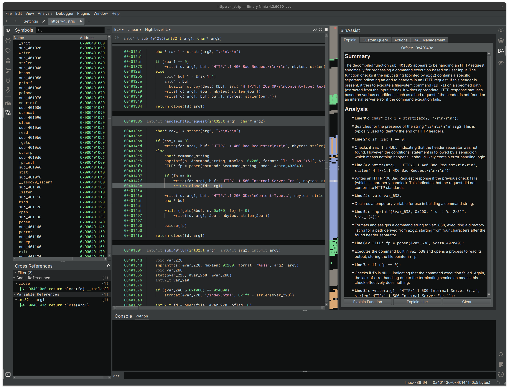

# BinAssist
Author: **Jason Tang**

_A local LLM Assistant to aid in binary RE and exploration._

## Description:
This is a LLM plugin aimed at enabling the use of local LLM's (ollama, text-generation-webui, lm-studio, etc) for assisting with binary exploration and reverse engineering. It supports any OpenAI v1-compatible API. Recommended models are LLaMA3-based models such as dolphin-llama3:8b, but others should work as well.

Current features include:
* Explain the current function - works at all IL levels.
* Explain the current instruction - disassembly and LLIL.
* RLHF dataset generation - to enable model fine tuning.
* General query - query the LLM directly from the UI.
* Settings to modify API host, key, model name and max tokens.

Future Roadmap:
* Agentic assistant - Use Autogen framework for self-guided binary RE.
* Propose actions - Provide a list of proposed actions to apply.
* Function calling - Allow agent to call functions to navigate the binary, rename functions and variables.

## Screenshot

## License

This plugin is released under an [MIT license](./LICENSE).
