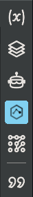

# Getting Started with BinAssist

This guide will help you install BinAssist, configure an LLM provider, and run your first analysis.

## Prerequisites

Before installing BinAssist, ensure you have:

- **Binary Ninja**: Version 5000 or higher
- **Python**: Python 3.8+ (included with Binary Ninja)
- **Internet connection**: For cloud providers or downloading local models

## Installation

### Step 0: Running Windows? Read this first

BinAssist works on Windows, but the MCP SDK has some dependencies that require manual effort to install properly. Please refer to: [BinAssist on Windows](binassist-on-windows.md)

### Step 1: Install the Plugin

BinAssist can be installed from the Binary Ninja Plugin Manager or manually:

**Option A: Plugin Manager (Recommended)**

1. Open Binary Ninja
2. Go to **Edit > Preferences > Plugin Manager**
3. Search for "BinAssist"
4. Click **Install**
5. Restart Binary Ninja

**Option B: Manual Installation**

1. Download or clone the BinAssist repository
2. Copy the `BinAssist` folder to your Binary Ninja plugins directory:
   - **Linux**: `~/.binaryninja/plugins/`
   - **macOS**: `~/Library/Application Support/Binary Ninja/plugins/`
   - **Windows**: `%APPDATA%\Binary Ninja\plugins\`
3. Restart Binary Ninja

### Step 2: Install Dependencies

Open a terminal in the BinAssist plugin directory and run:

```bash
pip install -r requirements.txt
```

This installs the required Python packages:
- `openai` - OpenAI and compatible API client
- `anthropic` - Anthropic Claude API client
- `httpx` - HTTP client for API calls
- `mcp` - Model Context Protocol client
- `whoosh` - Full-text search for RAG

## Initial Configuration

After installation, you need to configure at least one LLM provider.

### Opening BinAssist

1. Load any binary in Binary Ninja
2. Look for the robot icon in the sidebar (left side - below the Sidekick icon)
3. Click the icon to open the BinAssist panel


<!-- SCREENSHOT: Binary Ninja sidebar showing the BinAssist robot icon -->

### Accessing Settings

1. In the BinAssist panel, click the **Settings** tab (last tab)
2. You'll see the LLM Providers section at the top

## Setting Up an LLM Provider

BinAssist supports multiple LLM providers. Choose the one that best fits your needs:

### Option 1: Ollama (Local, Free, Private)

Ollama runs models locally on your machine, ensuring privacy and avoiding API costs.

**Step 1: Install Ollama**

```bash
# Linux/macOS
curl -fsSL https://ollama.ai/install.sh | sh

# Windows: Download from https://ollama.ai/download
```

**Step 2: Pull a Model**

```bash
# General purpose model
ollama pull llama3.1:8b

# Or a reasoning model (recommended for complex analysis)
ollama pull gpt-oss:20b

# Start the server
ollama serve
```

**Step 3: Configure in BinAssist**

1. In the Settings tab, click **Add** in the LLM Providers section
2. Fill in the fields:
   - **Name**: `Ollama Local`
   - **Type**: Select `Ollama`
   - **Model**: `llama3.1:8b` (or your chosen model)
   - **URL**: `http://localhost:11434`
   - **API Key**: Leave empty
   - **Max Tokens**: `8192`
3. Click **Save**
4. Click **Test** to verify the connection

### Option 2: OpenAI Platform API

Use OpenAI's models with a paid API key.

**Step 1: Get an API Key**

1. Go to [platform.openai.com](https://platform.openai.com/)
2. Sign up or log in
3. Navigate to **API Keys**
4. Create a new API key
5. Copy the key (you won't be able to see it again)

**Step 2: Configure in BinAssist**

1. Click **Add** in the LLM Providers section
2. Fill in the fields:
   - **Name**: `OpenAI`
   - **Type**: Select `OpenAI Platform API`
   - **Model**: `gpt-5.2-codex`
   - **URL**: Leave empty (uses default)
   - **API Key**: Paste your API key
   - **Max Tokens**: `20000`
3. Click **Save**
4. Click **Test** to verify

### Option 3: Anthropic Platform API

Use Anthropic's Claude models with a paid API key.

**Step 1: Get an API Key**

1. Go to [console.anthropic.com](https://console.anthropic.com/)
2. Sign up or log in
3. Navigate to **API Keys**
4. Create a new API key
5. Copy the key

**Step 2: Configure in BinAssist**

1. Click **Add** in the LLM Providers section
2. Fill in the fields:
   - **Name**: `Anthropic Claude`
   - **Type**: Select `Anthropic Platform API`
   - **Model**: `claude-sonnet-4-5` (or `claude-opus-4-5`)
   - **URL**: Leave empty (uses default)
   - **API Key**: Paste your API key
   - **Max Tokens**: `20000`
3. Click **Save**
4. Click **Test** to verify

### Option 4: OAuth Providers (Claude Pro/Max or ChatGPT Pro/Plus)

If you have a Claude Pro/Max or ChatGPT Pro/Plus subscription, you can use OAuth authentication instead of an API key.

**For Claude Pro/Max:**

1. Click **Add** in the LLM Providers section
2. Select **Type**: `Anthropic OAuth`
3. Fill in a **Name** and **Model** (e.g., `claude-sonnet-4-5`)
4. Click **Authenticate**
5. A browser window will open for you to sign in to your Anthropic account
6. After authorization, the credentials will be saved automatically
7. Click **Save**

**For ChatGPT Pro/Plus:**

1. Click **Add** in the LLM Providers section
2. Select **Type**: `OpenAI OAuth`
3. Fill in a **Name** and **Model** (e.g., `gpt-5.2-codex`)
4. Click **Authenticate**
5. A browser window will open for you to sign in to your OpenAI account
6. After authorization, the credentials will be saved automatically
7. Click **Save**

### Setting the Active Provider

After adding providers, select the one you want to use:

1. In the **Active Provider** dropdown at the bottom of the LLM Providers section
2. Select your configured provider
3. This provider will be used for all BinAssist operations

## Your First Analysis

Now that BinAssist is configured, let's run your first analysis.

### Step 1: Load a Binary

1. Open a binary file in Binary Ninja (**File > Open**)
2. Wait for the initial analysis to complete

### Step 2: Navigate to a Function

1. In the Functions list (left panel), click on any function
2. Or use **Go to Address** (G key) to jump to a specific location

### Step 3: Explain the Function

1. Open the BinAssist sidebar (robot icon)
2. Click the **Explain** tab
3. Click the **Explain Function** button
4. Wait for the LLM response to stream in

You should see:
- A detailed explanation of what the function does
- Security analysis panel with risk assessment
- Activity profile and detected API patterns

### Step 4: Ask a Question

1. Switch to the **Query** tab
2. Type a question in the input field, for example:
   - "What does this function do?"
   - "Are there any security concerns here?"
   - "What functions does this call?"
3. Press Enter or click Send
4. Watch the response stream in

## Next Steps

Now that you have BinAssist working, explore these features:

- **[Explain Workflow](workflows/explain-workflow.md)**: Learn to build context across your analysis
- **[Query Workflow](workflows/query-workflow.md)**: Master interactive queries and the ReAct agent
- **[Semantic Graph Workflow](workflows/semantic-graph-workflow.md)**: Build a knowledge graph of your binary
- **[Settings Reference](tabs/settings-tab.md)**: Configure advanced options

## Troubleshooting

### "Connection failed" when testing provider

- **Ollama**: Ensure `ollama serve` is running
- **Cloud providers**: Verify your API key is correct
- **Network issues**: Check firewall and proxy settings

### No response from LLM

- Check the Binary Ninja log (View > Log) for error messages
- Verify the model name is correct for your provider
- Ensure you have sufficient API credits (for paid providers)

### Plugin not appearing in sidebar

- Restart Binary Ninja after installation
- Check that all dependencies are installed
- Verify the plugin is in the correct directory

### Slow responses

- Local models: Consider using a smaller model or getting a better GPU
- Cloud providers: This is normal for reasoning models (o1, Claude with extended thinking)
- Large functions: Try analyzing smaller functions first

For additional help, check the [GitHub Issues](https://github.com/jtang613/BinAssist/issues) page.
