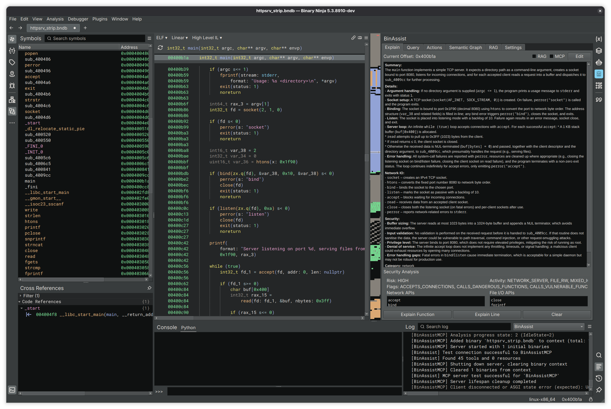

# BinAssist Documentation

**BinAssist** is a comprehensive LLM-powered plugin for Binary Ninja that enhances binary analysis and reverse engineering workflows through intelligent automation.

<!-- SCREENSHOT: BinAssist sidebar open in Binary Ninja showing the tab bar with all seven tabs visible, with a binary loaded and the Explain tab active -->

## What is BinAssist?

BinAssist integrates large language models directly into your reverse engineering workflow. Rather than switching between tools or manually copying code snippets, you can ask questions, generate explanations, and receive intelligent suggestions without leaving Binary Ninja.

The plugin supports both local LLMs (via Ollama, LM Studio) and cloud providers (OpenAI, Anthropic), giving you flexibility to choose the right model for your needs and privacy requirements.

## Core Capabilities

BinAssist is organized into seven tabs, each focused on a specific aspect of LLM-assisted analysis:

| Tab | Purpose |
|-----|---------|
| **[Explain](tabs/explain-tab.md)** | Generate and store function/instruction explanations with security analysis |
| **[Query](tabs/query-tab.md)** | Interactive chat with context macros and autonomous ReAct agent |
| **[Actions](tabs/actions-tab.md)** | LLM-powered suggestions for renaming functions, variables, and creating structs |
| **[Semantic Graph](tabs/semantic-graph-tab.md)** | Build a knowledge graph of function relationships and security properties |
| **[RAG](tabs/rag-tab.md)** | Manage external documentation for context-enhanced queries |
| **[Settings](tabs/settings-tab.md)** | Configure LLM providers, MCP servers, and plugin options |

## Key Features

### MCP Tool Integration

BinAssist supports the Model Context Protocol (MCP), allowing LLMs to directly interact with Binary Ninja through tool calls. When MCP is enabled, the LLM can:

- Navigate to functions and addresses
- Retrieve decompiled code and disassembly
- Query cross-references
- Access the semantic graph
- And more through connected MCP servers

See the [Query Workflow](workflows/query-workflow.md) for details on using MCP tools.

### ReAct Autonomous Agent

For complex investigations, BinAssist includes a ReAct (Reasoning + Acting) agent that can autonomously:

1. Plan an investigation based on your question
2. Execute multiple tool calls to gather information
3. Reflect on findings and adapt its approach
4. Synthesize a comprehensive answer

This is particularly useful for exploratory questions like "What vulnerabilities exist in this binary?" or "Trace the data flow from user input."

### Extended Thinking

For models that support it (Claude Sonnet 4+, OpenAI o1/o3, Ollama gpt-oss), BinAssist provides reasoning effort control:

| Level | Use Case |
|-------|----------|
| None | Quick queries, simple questions |
| Low | Light reasoning tasks |
| Medium | Moderate complexity analysis |
| High | Deep analysis, complex vulnerability research |

Higher reasoning effort allows the model more "thinking time" but increases latency and cost.

### Semantic Graph

Build a rich knowledge graph of your binary that captures:

- Function summaries and purposes
- Call relationships
- Security flags (network, file I/O, crypto, etc.)
- Taint flow paths for vulnerability detection
- Function communities and modules

This graph can be queried directly or used to enhance LLM responses with relevant context.

## Supported LLM Providers

BinAssist supports a wide range of LLM providers:

| Provider Type | Description |
|---------------|-------------|
| **Ollama** | Local LLM inference (recommended for privacy) |
| **LM Studio** | Local models with GUI |
| **Open WebUI** | Self-hosted web interface |
| **OpenAI Platform** | GPT-4, GPT-4o, o1, o3 with API key |
| **OpenAI OAuth** | ChatGPT Pro/Plus subscription |
| **Anthropic Platform** | Claude models with API key |
| **Anthropic OAuth** | Claude Pro/Max subscription |
| **Anthropic CLI** | Claude Code CLI wrapper |
| **LiteLLM** | Proxy for 100+ providers (AWS Bedrock, Azure, etc.) |

### Recommended Models

- **For reasoning-intensive tasks**: Claude Sonnet 4+, OpenAI o1/o3, gpt-oss (with extended thinking)
- **For general analysis**: GPT-4o, Claude Sonnet 3.5, DeepSeek, Llama-based models
- **For local/private analysis**: Ollama with gpt-oss, qwen2.5-coder, or codellama

## Architecture Overview

BinAssist uses a clean Model-View-Controller architecture:

- **Views**: Qt-based UI components for each tab
- **Controllers**: Business logic and LLM interaction coordination
- **Services**: Reusable services for settings, analysis storage, RAG, and more

All LLM operations run in background threads to keep the UI responsive, with streaming support for real-time response display.

## Getting Started

Ready to start using BinAssist? See the [Getting Started Guide](getting-started.md) for installation and configuration instructions.

## Common Workflows

- [Building Context with the Explain Tab](workflows/explain-workflow.md)
- [Interactive Queries and the ReAct Agent](workflows/query-workflow.md)
- [Building a Semantic Graph](workflows/semantic-graph-workflow.md)

## Tab Reference

- [Explain Tab](tabs/explain-tab.md)
- [Query Tab](tabs/query-tab.md)
- [Actions Tab](tabs/actions-tab.md)
- [Semantic Graph Tab](tabs/semantic-graph-tab.md)
- [RAG Tab](tabs/rag-tab.md)
- [Settings Tab](tabs/settings-tab.md)
