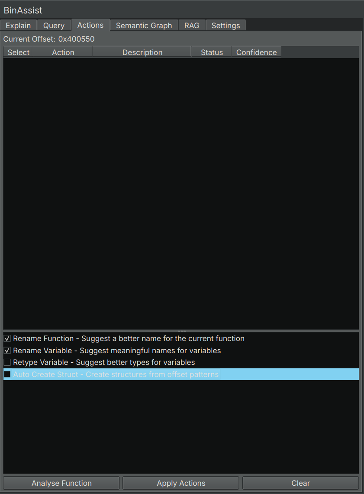

# Actions Tab Reference

The Actions tab provides LLM-powered suggestions for improving your binary analysis, including renaming functions and variables, retyping variables, and creating structures.

<!-- SCREENSHOT: Actions tab showing action type checkboxes at top, Analyse button, and results table with suggestions -->

## Purpose

The Actions tab automates common reverse engineering tasks by using the LLM to:

- Suggest meaningful names for functions based on their behavior
- Propose descriptive variable names based on usage
- Recommend appropriate data types for variables
- Generate structure definitions from data patterns

Each suggestion includes a confidence score, allowing you to review before applying.

## Action Types

### Rename Function

Analyzes the current function's behavior and suggests a semantically meaningful name.

**Example**: A function that parses HTTP headers might be renamed from `sub_401000` to `parse_http_headers`.

### Rename Variable

Examines how variables are used within the function and proposes descriptive names.

**Example**: A variable used as a loop counter might be renamed from `var_8` to `loop_index`.

### Retype Variable

Analyzes variable usage patterns and recommends appropriate data types.

**Example**: A variable used to store string pointers might be retyped from `int64_t` to `char*`.

### Auto Create Struct

Identifies data access patterns that suggest structure usage and generates structure definitions.

**Example**: Repeated accesses at offsets 0, 8, and 16 from a base pointer might suggest a structure with three fields.

## UI Elements

### Action Selection

Checkboxes at the top let you select which action types to include in the analysis:

- Check the actions you want suggestions for
- Uncheck actions you don't need
- At least one action must be selected

### Analyse Button

Click **Analyse** to run the LLM analysis for the selected action types on the current function.

### Results Table

After analysis, suggestions appear in a table:

| Column | Description |
|--------|-------------|
| **Select** | Checkbox to include in batch apply |
| **Action** | The type of action (Rename Function, etc.) |
| **Target** | What the action affects (function name, variable name) |
| **Suggestion** | The LLM's recommendation |
| **Confidence** | Score from 0.0 to 1.0 |
| **Status** | Result after applying (Success, Failed, Pending) |

### Apply Button

Click **Apply Selected** to apply all checked suggestions to the binary.

## Confidence Scores

Each suggestion includes a confidence score indicating the LLM's certainty:

| Score Range | Interpretation |
|-------------|----------------|
| **0.9 - 1.0** | High confidence - likely accurate |
| **0.7 - 0.9** | Good confidence - review recommended |
| **0.5 - 0.7** | Moderate confidence - careful review |
| **< 0.5** | Low confidence - may be incorrect |

Use confidence scores to prioritize your review. High-confidence suggestions are generally safe to apply, while lower scores warrant more scrutiny.

## Workflow

1. Navigate to a function in Binary Ninja
2. Open the Actions tab
3. Select the desired action types
4. Click **Analyse**
5. Review the suggestions and confidence scores
6. Check the suggestions you want to apply
7. Click **Apply Selected**
8. Verify the changes in Binary Ninja

## Status Indicators

After applying suggestions, the Status column shows:

- **Success**: The action was applied successfully
- **Failed**: The action could not be applied (e.g., invalid name)
- **Skipped**: The action was not selected

## Tool-Based Architecture

Behind the scenes, the Actions tab uses LLM tool calling to generate precise suggestions. This ensures:

- Structured output that can be reliably parsed
- Clear separation between suggestion and application
- Detailed information for each suggestion

## Related Documentation

- [Explain Tab](explain-tab.md) - Understanding functions before renaming
- [Query Tab](query-tab.md) - Asking questions about naming choices
- [Settings Tab](settings-tab.md) - Configuring LLM providers
