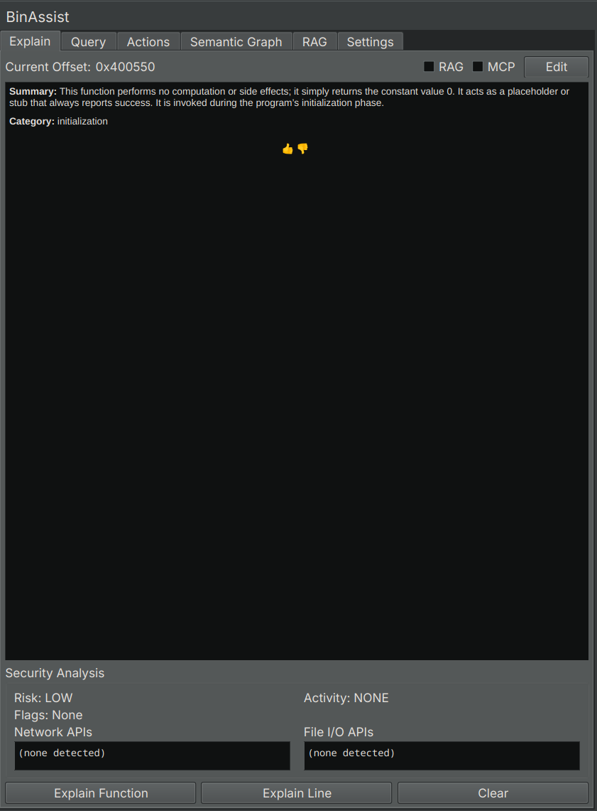

# Explain Tab Reference

The Explain tab generates and stores LLM-powered explanations of functions and instructions, with integrated security analysis.

<!-- SCREENSHOT: Explain tab showing a function explanation with rendered markdown, security panel visible below -->

## Purpose

The Explain tab helps you build a documented understanding of a binary by:

- Generating detailed explanations of functions at all IL levels
- Providing security assessments and risk analysis
- Storing explanations for later reference
- Allowing you to edit and refine the LLM's output

## UI Elements

### Analysis Buttons

| Button | Description |
|--------|-------------|
| **Explain Function** | Analyze the entire current function |
| **Explain Line** | Analyze the specific instruction at the cursor |

### Enhancement Options

| Option | Description |
|--------|-------------|
| **RAG** | Include context from indexed documents (see [RAG Tab](rag-tab.md)) |
| **MCP** | Enable tool calling for enhanced analysis |

When RAG is enabled, relevant documentation from your indexed documents is included in the LLM prompt. When MCP is enabled, the LLM can call tools to gather additional information.

### Display Area

The main display area shows the LLM's explanation rendered as markdown. This includes:

- Function purpose and behavior
- Parameter descriptions
- Return value analysis
- Notable implementation details

### Security Analysis Panel

Below the explanation, an expandable panel shows security-related analysis:

| Field | Description |
|-------|-------------|
| **Risk Level** | Overall risk assessment (Low, Medium, High, Critical) |
| **Activity Profile** | Categories of function behavior (e.g., "Data Processing", "Network Communication") |
| **Security Flags** | Detected security-relevant patterns |
| **Network APIs** | Network-related function calls detected |
| **File I/O APIs** | File operation calls detected |

### Edit Mode

Toggle the **Edit** button to modify the explanation:

1. Click **Edit** to enter edit mode
2. Modify the text as needed
3. Click **Save** to store your changes

Your edits are saved to the analysis database and will be displayed the next time you view this function.

### RLHF Feedback

Use the thumbs up/thumbs down buttons to provide feedback on the explanation quality. This data is stored in the RLHF database and can be used for model improvement.

## Function Context

The Explain tab automatically detects the current function based on your cursor position in Binary Ninja. The function name and address are displayed at the top of the tab.

If no function is selected, the analysis buttons will be disabled.

## Analysis Levels

When explaining a function, BinAssist analyzes it at multiple IL (Intermediate Language) levels:

- **LLIL**: Low-Level IL - closest to assembly
- **MLIL**: Medium-Level IL - simplified operations
- **HLIL**: High-Level IL - closest to source code

This multi-level analysis provides a comprehensive understanding of the function's behavior.

## Stored Explanations

Explanations are stored in the analysis database, keyed by:
- Binary SHA256 hash
- Function address

When you return to a previously explained function, the stored explanation is displayed automatically. This allows you to build up documentation across your analysis sessions.

## Related Documentation

- [Explain Workflow](../workflows/explain-workflow.md) - Step-by-step guide to using the Explain tab
- [RAG Tab](rag-tab.md) - Managing documents for context enhancement
- [Settings Tab](settings-tab.md) - Configuring LLM providers
