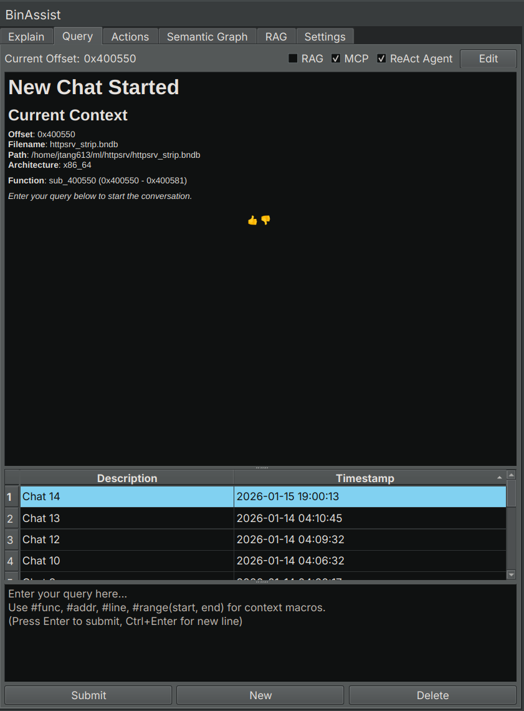

# Query Tab Reference

The Query tab provides an interactive chat interface for asking questions about your binary, with support for context macros, MCP tools, and the autonomous ReAct agent.


<!-- SCREENSHOT: Query tab showing chat history on the left, message display area in the center, and input field at the bottom -->

## Purpose

The Query tab enables free-form conversation with the LLM about your binary. Unlike the Explain tab's structured analysis, Query allows you to:

- Ask any question about the code
- Follow up on previous responses
- Enable autonomous multi-step investigations
- Use context macros to reference specific binary elements

## UI Elements

### Chat History

The left panel shows your conversation history:

- Each chat is listed with a timestamp
- Click a chat to view its contents
- **New**: Create a new conversation
- **Delete**: Remove the selected conversation

### Message Display

The central area displays the conversation:

- Your messages appear as user prompts
- LLM responses are rendered as markdown
- Tool calls (when MCP is enabled) show the tool name and result
- Responses stream in real-time

### Input Area

At the bottom:

- Text input field for your message
- **Send** button (or press Enter)
- **Stop** button (visible during generation)

### Enhancement Options

| Option | Description |
|--------|-------------|
| **RAG** | Include context from indexed documents |
| **MCP** | Enable tool calling for binary analysis |
| **Agentic** | Enable the ReAct autonomous agent |

## Context Macros

Context macros let you reference specific binary elements in your queries. The macro is replaced with the actual data before sending to the LLM.

| Macro | Description | Example |
|-------|-------------|---------|
| `#func` | Current function's decompiled code | "What does #func do?" |
| `#addr` | Data at the current address | "What is stored at #addr?" |
| `#line` | Current instruction | "Explain #line" |
| `#range(start, end)` | Data in address range | "Analyze #range(0x1000, 0x1100)" |

### Using Context Macros

Simply include the macro in your message:

```
What vulnerabilities exist in #func?
```

The LLM receives the full decompiled code of the current function along with your question.

## MCP Tool Calling

When **MCP** is enabled, the LLM can call tools from connected MCP servers to gather information:

Common tools include:
- Decompiling functions
- Looking up cross-references
- Navigating to addresses
- Querying the semantic graph

The LLM decides which tools to call based on your question.

## ReAct Agent (Agentic Mode)

When **Agentic** is enabled, BinAssist uses the ReAct (Reasoning + Acting) agent for autonomous multi-step investigations.

### How ReAct Works

1. **Planning**: The agent creates an investigation plan based on your question
2. **Investigation**: For each step, the agent calls tools and gathers information
3. **Reflection**: The agent assesses progress and may adapt the plan
4. **Synthesis**: After gathering sufficient information, the agent provides a comprehensive answer

### When to Use ReAct

ReAct is ideal for:
- Complex questions requiring multiple tool calls
- Exploratory analysis ("What does this binary do?")
- Security auditing ("Find vulnerabilities in this code")
- Tracing data flows across functions

### ReAct Progress Display

During a ReAct investigation, you'll see:
- The investigation plan with checkboxes
- Current step being executed
- Tool calls and their results
- The final synthesized answer

## Streaming Responses

All LLM responses stream in real-time, allowing you to:
- See the response as it's generated
- Stop generation early if the response isn't useful
- Get faster feedback on simple queries

## Edit Mode

Like the Explain tab, you can edit chat messages:
- Toggle edit mode to modify messages
- Save changes to update the conversation

## Related Documentation

- [Query Workflow](../workflows/query-workflow.md) - Detailed guide to querying and ReAct
- [Settings Tab](settings-tab.md) - Configuring MCP servers
- [Semantic Graph Tab](semantic-graph-tab.md) - Building context for queries
