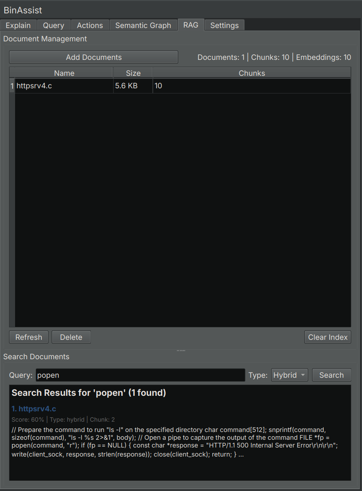

# RAG Tab Reference

The RAG (Retrieval-Augmented Generation) tab manages external documentation that can be used to enhance LLM responses with relevant context.

<!-- SCREENSHOT: RAG tab showing document table with name/size/chunks columns, Add/Refresh/Delete buttons, search section, and statistics -->

## Purpose

RAG allows you to import documentation relevant to your analysis, such as:

- API documentation for libraries used by the binary
- Protocol specifications
- Vendor documentation
- Research papers
- Previous analysis notes

When RAG is enabled in the Explain or Query tabs, relevant portions of your indexed documents are included in the LLM prompt, improving response quality.

## How RAG Works

1. You import documents into BinAssist
2. Documents are split into chunks and indexed
3. When you ask a question with RAG enabled, BinAssist searches for relevant chunks
4. Relevant chunks are included in the LLM prompt
5. The LLM uses this context to provide better answers

## UI Elements

### Document Table

Lists all imported documents:

| Column | Description |
|--------|-------------|
| **Name** | Document filename |
| **Size** | File size |
| **Chunks** | Number of indexed chunks |

Select a document to enable the Refresh and Delete buttons.

### Management Buttons

| Button | Description |
|--------|-------------|
| **Add Document** | Import a new document |
| **Refresh** | Re-index the selected document |
| **Delete** | Remove the selected document from the index |

### Search Section

Test the RAG index by searching for content:

- **Search Input**: Enter keywords or phrases
- **Search Mode**: Select the search algorithm
- **Results**: Display matching chunks with relevance scores

### Statistics Panel

Shows index statistics:

| Statistic | Description |
|-----------|-------------|
| **Documents** | Number of indexed documents |
| **Chunks** | Total chunks across all documents |
| **Embeddings** | Vector embeddings count |

### Index Management

- **Clear Index**: Delete all documents and reset the RAG index

## Supported Document Types

BinAssist can index the following document types:

| Type | Extension | Notes |
|------|-----------|-------|
| **Text** | `.txt` | Plain text files |
| **Markdown** | `.md` | Markdown formatted documents |
| **PDF** | `.pdf` | PDF documents (future) |

## Search Modes

When searching or retrieving context, BinAssist supports three search modes:

| Mode | Description | Best For |
|------|-------------|----------|
| **Hybrid** | Combines text and vector search | General use (recommended) |
| **Text** | Keyword-based full-text search | Exact term matching |
| **Vector** | Semantic similarity search | Conceptual queries |

## Adding Documents

1. Click **Add Document**
2. Select a file from your system
3. Wait for indexing to complete
4. The document appears in the table

Documents are automatically chunked for efficient retrieval. Large documents may take a moment to process.

## Using RAG in Analysis

To use RAG context in your analysis:

1. Import relevant documents in the RAG tab
2. Switch to the Explain or Query tab
3. Enable the **RAG** checkbox
4. Perform your analysis or ask your question
5. The LLM receives relevant document context automatically

## Best Practices

### Document Selection

Import documents that are directly relevant to your analysis:

- API documentation for libraries the binary uses
- Protocol specs for network protocols in use
- Vendor manuals for the software being analyzed
- Research papers on relevant techniques or malware families

### Document Size

- Smaller, focused documents work better than large general references
- Consider splitting very large documents into focused sections
- Remove irrelevant sections before importing

### Refreshing Documents

Use **Refresh** when:

- The source document has been updated
- You want to re-chunk with different settings
- The index seems to be returning poor results

## Index Storage

The RAG index is stored in the BinAssist data directory (see [Settings Tab](settings-tab.md) for the path). It persists across sessions, so you don't need to re-import documents each time.

## Related Documentation

- [Explain Tab](explain-tab.md) - Using RAG with function explanations
- [Query Tab](query-tab.md) - Using RAG with chat queries
- [Settings Tab](settings-tab.md) - Configuring RAG storage path
