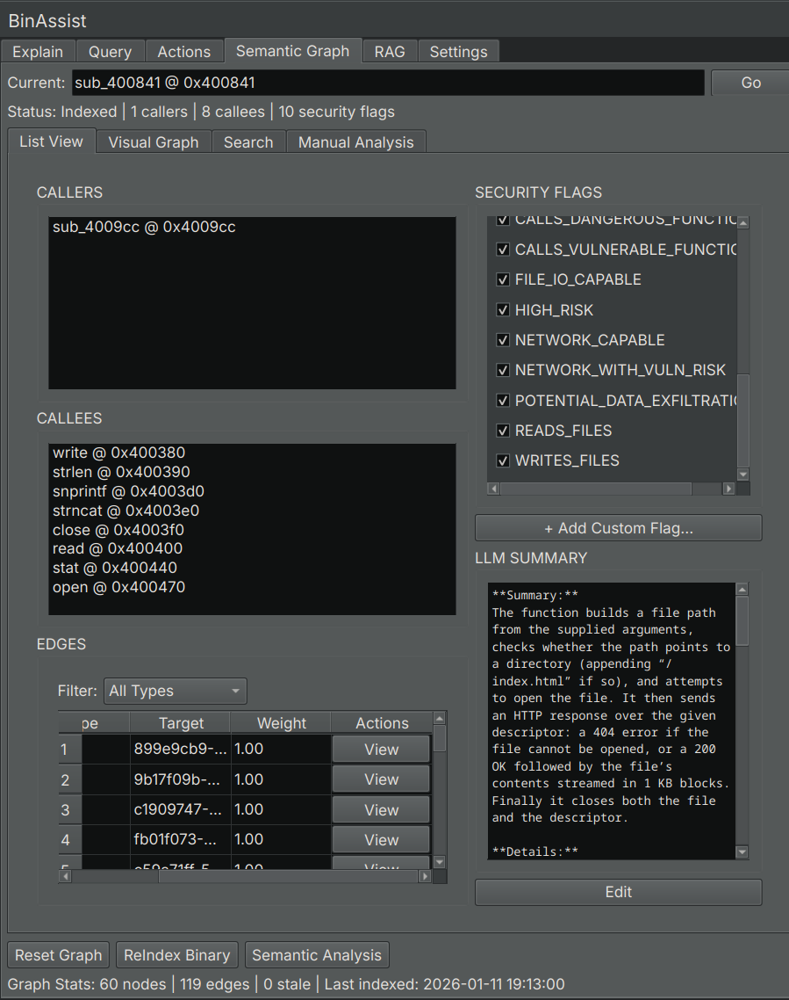
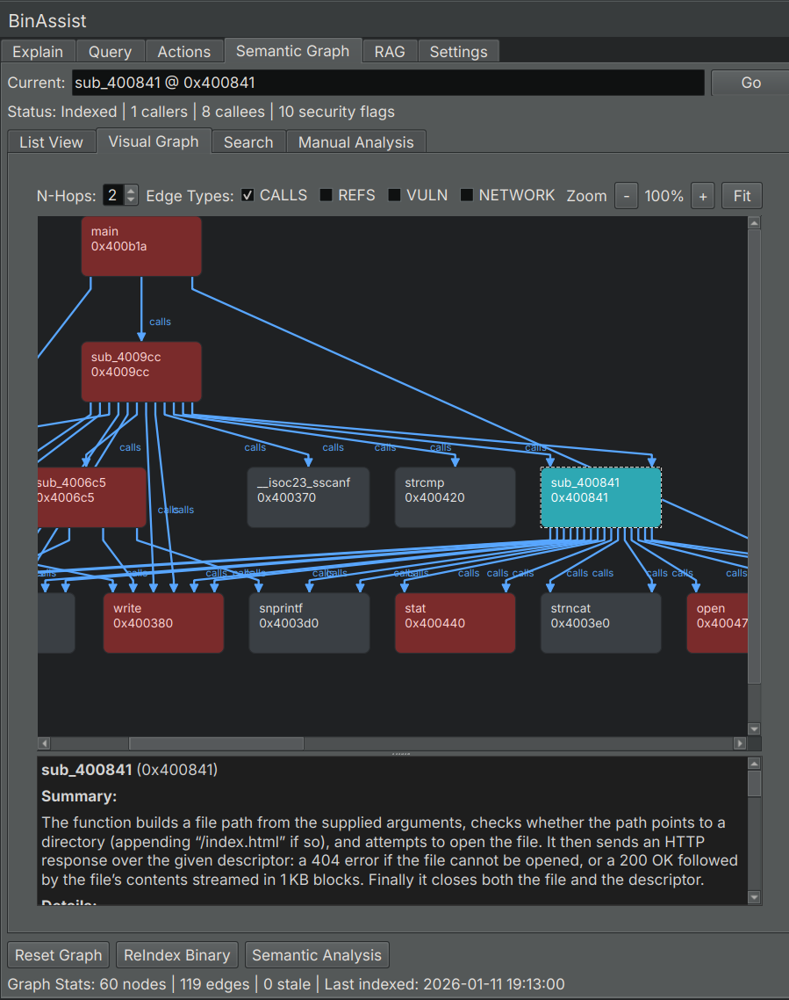

# Semantic Graph Tab Reference

The Semantic Graph tab builds and explores a knowledge graph of your binary, capturing function relationships, security properties, and semantic information.

<!-- SCREENSHOT: Semantic Graph tab showing the List View sub-tab with function table and analysis buttons -->

## Purpose

The Semantic Graph tab creates a rich, queryable knowledge base of your binary that:

- Maps function call relationships
- Stores LLM-generated function summaries
- Detects security-relevant patterns
- Groups related functions into communities
- Enables security-focused taint analysis

This graph can be queried directly through the UI or used to enhance LLM responses in other tabs.

## Sub-Tabs

The Semantic Graph tab contains four sub-tabs:

### List View

Displays all indexed functions in a searchable table.

| Column | Description |
|--------|-------------|
| **Address** | Function start address |
| **Name** | Function name (or generated symbol) |
| **Summary** | LLM-generated description of function purpose |
| **Flags** | Security flags (network, file I/O, crypto, etc.) |
| **Community** | Detected function group/module |

Click a row to:
- View the function's callers and callees
- Navigate to the function in Binary Ninja

### Visual Graph

Interactive visualization of function relationships.

<!-- SCREENSHOT: Visual Graph view showing nodes representing functions connected by edges representing call relationships -->

- **Nodes**: Functions, sized by importance
- **Edges**: Call relationships
- **Colors**: Community membership or security flags

Navigation:
- **Pan**: Click and drag
- **Zoom**: Scroll wheel
- **Select**: Click a node to view details

### Search

Full-text search across function names and summaries.

Enter keywords to find functions by:
- Function name
- Summary content
- Security-related terms

Results show matching functions with relevant excerpts highlighted.

### Manual Analysis

Controls for running individual analysis pipelines.

## Analysis Buttons

The Manual Analysis panel provides buttons to run specific analysis types:

| Button | Description |
|--------|-------------|
| **ReIndex Binary** | Extract all functions and build call graph |
| **Semantic Analysis** | Generate LLM summaries for all functions |
| **Security Analysis** | Run taint analysis for vulnerability detection |
| **Community Detection** | Group related functions using Label Propagation |
| **Clear Graph** | Delete the semantic graph and start fresh |

### ReIndex Binary

Extracts function information and builds the call relationship graph:

- Function addresses, names, and sizes
- Direct call relationships (CALLS edges)
- Import and export identification

This is the foundation for all other analyses.

### Semantic Analysis

Uses the LLM to analyze each function and generate:

- Purpose summary
- Activity profile (what the function does)
- Security flags (network, file I/O, crypto, etc.)
- Risk assessment

This runs on all functions that don't already have summaries.

### Security Analysis

Performs taint analysis to find potential vulnerabilities:

- Identifies source functions (user input, network receive, file read)
- Identifies sink functions (dangerous operations like strcpy, sprintf)
- Traces data flow paths from sources to sinks
- Creates TAINT_FLOWS_TO and VULNERABLE_VIA edges

Discovered paths are stored in the graph for later review.

### Community Detection

Groups related functions using the Label Propagation algorithm:

- Analyzes call relationships
- Identifies clusters of related functions
- Labels communities by common purpose (e.g., "Network I/O", "Crypto", "File Operations")

Communities help you understand the binary's modular structure.

## Graph Statistics

The bottom of the tab displays current graph statistics:

| Statistic | Description |
|-----------|-------------|
| **Functions** | Number of indexed functions |
| **Edges** | Number of relationships (calls, taint flows) |
| **Communities** | Number of detected function groups |

## Using the Graph

### With LLM Queries

When MCP is enabled in the Query tab, the LLM can query the semantic graph to:

- Find functions by purpose
- Trace call chains
- Identify security-relevant functions
- Explore community relationships

### For Manual Analysis

Use the List View and Search to:
- Find functions matching criteria
- Review security flags
- Understand function purposes
- Navigate the binary systematically

## Related Documentation

- [Semantic Graph Workflow](../workflows/semantic-graph-workflow.md) - Step-by-step guide to building and using the graph
- [Query Tab](query-tab.md) - Using the graph with MCP queries
