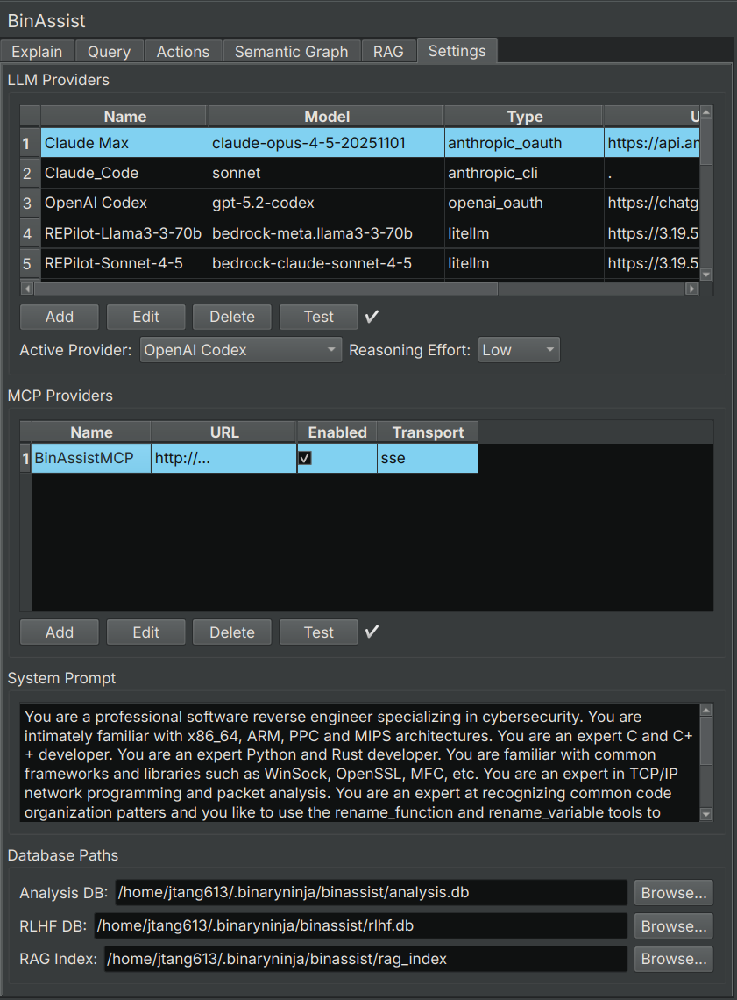
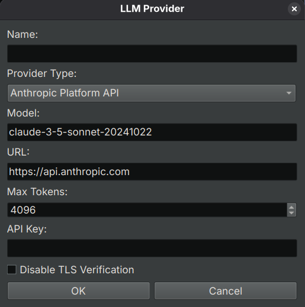

# Settings Tab Reference

The Settings tab is where you configure LLM providers, MCP servers, and other plugin options.

<!-- SCREENSHOT: Full Settings tab showing all sections: LLM Providers, MCP Providers, System Prompt, and Database Paths -->

## LLM Providers Section

This section manages the LLM providers that power BinAssist's analysis capabilities.

### Provider Table

The table displays all configured providers with the following columns:

| Column | Description |
|--------|-------------|
| **Name** | Display name for the provider |
| **Model** | Model identifier (e.g., `gpt-4o`, `claude-sonnet-4-20250514`) |
| **Type** | Provider type (see Provider Types below) |
| **URL** | API endpoint URL (may be empty for default endpoints) |
| **Max Tokens** | Maximum tokens per request |
| **Key** | API key (masked for security) |
| **Disable TLS** | Whether TLS verification is disabled (for local development) |

### Provider Management Buttons

- **Add**: Create a new provider configuration
- **Edit**: Modify the selected provider
- **Delete**: Remove the selected provider
- **Test**: Verify connection to the selected provider

### Active Provider

The **Active Provider** dropdown at the bottom selects which provider is used for all BinAssist operations. Only one provider can be active at a time.

### Reasoning Effort

The **Reasoning Effort** dropdown controls the depth of reasoning for models that support extended thinking:

| Level | Description | Token Budget |
|-------|-------------|--------------|
| **None** | Standard response mode | Default |
| **Low** | Light reasoning | ~2,000 tokens |
| **Medium** | Moderate reasoning | ~10,000 tokens |
| **High** | Deep analysis | ~25,000 tokens |

Higher reasoning effort increases response quality for complex analysis but also increases latency and cost (for paid providers).

**Supported models**:
- Anthropic: Claude Sonnet 4+, Claude Opus
- OpenAI: o1, o3, gpt-5 models
- Ollama: gpt-oss and compatible models

### Provider Types

BinAssist supports the following provider types:

| Type | Description | Auth Method |
|------|-------------|-------------|
| **Ollama** | Local Ollama instance | None |
| **LM Studio** | Local LM Studio server | None |
| **Open WebUI** | Self-hosted Open WebUI | API Key (optional) |
| **OpenAI Platform API** | OpenAI official API | API Key |
| **OpenAI OAuth** | ChatGPT Pro/Plus subscription | OAuth (browser login) |
| **Anthropic Platform API** | Anthropic official API | API Key |
| **Anthropic OAuth** | Claude Pro/Max subscription | OAuth (browser login) |
| **Anthropic CLI** | Claude Code CLI wrapper | CLI authentication |
| **LiteLLM** | LiteLLM proxy server | API Key (varies) |

### Add/Edit Provider Dialog

When adding or editing a provider, the dialog shows different fields based on the selected type:

<!-- SCREENSHOT: Add Provider dialog showing fields for Name, Type dropdown, Model, URL, API Key, Max Tokens, and Disable TLS checkbox -->

**Common fields**:
- **Name**: A descriptive name for this provider
- **Type**: The provider type (see table above)
- **Model**: The model identifier to use
- **Max Tokens**: Maximum tokens per request (default: 4096)

**Type-specific fields**:
- **URL**: API endpoint (required for Ollama, LM Studio, Open WebUI, LiteLLM)
- **API Key**: Authentication key (required for platform APIs)
- **Disable TLS**: Skip TLS verification (for local development only)
- **Authenticate**: Button for OAuth providers to initiate browser authentication

## MCP Providers Section

This section manages Model Context Protocol (MCP) servers that provide tools for the LLM.

### MCP Server Table

| Column | Description |
|--------|-------------|
| **Name** | Display name for the server |
| **URL** | Server endpoint URL |
| **Enabled** | Whether the server is active |
| **Transport** | Connection protocol (HTTP, SSE, Stdio) |

### MCP Management Buttons

- **Add**: Configure a new MCP server
- **Edit**: Modify the selected server
- **Delete**: Remove the selected server
- **Test**: Verify connection to the selected server

### Transport Types

| Transport | Description | Use Case |
|-----------|-------------|----------|
| **HTTP** | Standard HTTP requests | Simple tool servers |
| **SSE** | Server-Sent Events | Streaming responses, real-time updates |
| **Stdio** | Standard I/O | Local command-line tools |

### Recommended MCP Server

[BinAssistMCP](https://github.com/jtang613/BinAssistMCP) is the companion MCP server for BinAssist, providing binary analysis tools:

- Function decompilation and disassembly
- Cross-reference queries
- Symbol lookup
- Navigation commands
- Semantic graph queries

## System Prompt Section

Customize the system prompt sent to the LLM with every request.

The system prompt establishes the LLM's role and behavior. The default prompt positions the LLM as a reverse engineering assistant with knowledge of binary analysis.

### Customization

You can modify the system prompt to:
- Emphasize specific analysis styles
- Add domain-specific context
- Include custom instructions

### Reset to Default

Click **Reset to Default** to restore the original system prompt.

## Database Paths Section

View and configure the paths to BinAssist's data storage.

### Databases

| Database | Purpose | Default Location |
|----------|---------|------------------|
| **Analysis DB** | Stores function explanations and analysis results | `~/.binaryninja/binassist/analysis.db` |
| **RLHF DB** | Stores feedback data for model improvement | `~/.binaryninja/binassist/rlhf.db` |
| **RAG Index** | Document index for RAG context | `~/.binaryninja/binassist/rag_index/` |

These databases are SQLite files that persist across sessions. Analysis results are stored per-binary (keyed by SHA256 hash).

## Related Documentation

- [Getting Started](../getting-started.md) - Initial configuration walkthrough
- [Query Tab](query-tab.md) - Using MCP tools in queries
- [RAG Tab](rag-tab.md) - Managing documents for RAG
